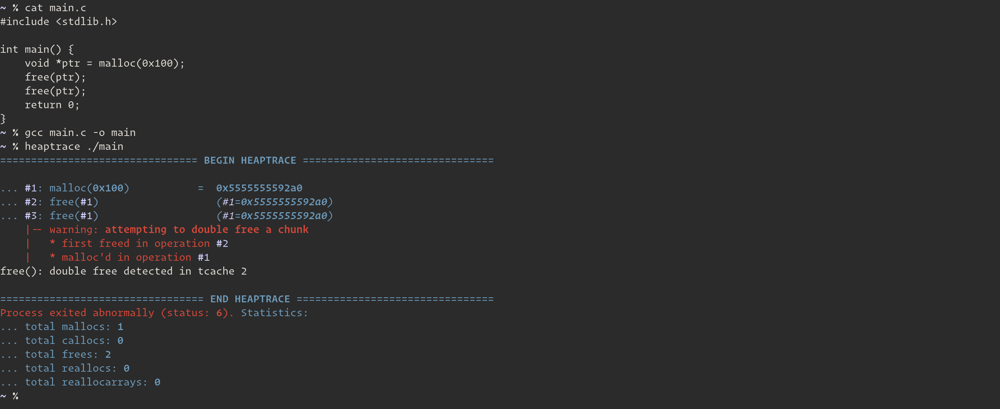

# About

heaptrace is a `ptrace`-based debugger similar to `ltrace` for tracking glibc heap operations (`malloc`, `free`, `realloc`) in ELF64 binaries. It is useful for debugging binaries and doing heap pwn.



## Main Features

* Prints out heap operations using symbols instead of pointers. This allows users to understand what is going on on the heap without having to compare pointer values at each operation.
* Detects some forms of heap corruption, double free vulnerabilities, and memory leakage issues.
* Allows users to set "breakpoints" at any heap operation number (`oid`). When heaptrace reaches the requested `oid` number, it immediately detaches itself from the tracee (the target binary) and attaches the GNU debugger (gdb). This allows users to easily debug the heap interactively at any point.

### Other Features

* Supports all 64-bit dynamically-linked (glibc) or statically-linked ELF64 binaries. Even if PIE is enabled or the binary is compiled without a PLT.
* Automatically resolves `malloc`/`free`/`realloc` symbols in libc and the binary, and soon will support manually inputting addresses for when ELF binaries are stripped.
* Disables ASLR so that heap pointers are the same across multiple deterministic executions.

# Installation

## Arch User Repository (PKGBUILD)

Use your preferred AUR helper to install the [`heaptrace-git`](https://aur.archlinux.org/packages/heaptrace-git/) package.

```
$ trizen -S heaptrace-git
```

## Manual

```sh
$ git clone https://github.com/Arinerron/heaptrace.git && cd heaptrace
$ ./compile.sh
...
$ ./heaptrace ./my-binary
```

# Usage

You can specify arguments to heaptrace before specifying the binary name:

```
Usage: ./heaptrace [-v] [-b/--break-at <oid>] [-s/--symbols <sym_defs>] [-o/--output <filename>] <binary> [args...]

-o <file>, --output=<file>  Write the heaptrace output to `file` instead of 
                            stderr (default).

-s <defs>, --symbols=<defs> Override the values heaptrace detects for the 
                            malloc/free/realloc/calloc symbols. If the binary 
                            is stripped, this argument is required to use 
                            heaptrace. See the wiki for more info.

-b <oid>, --break-at=<oid>  Send SIGSTOP to the process at heap operation 
                            specified in `oid` and attach the GNU debugger 
                            (gdb) to the process.

-v, --verbose               Print verbose information such as line numbers in
                            source code given the required debugging info is
                            stored in the ELF.
```

For example, if you wanted to automatically attach gdb at operation #3, you would execute:

```
./heaptrace --break-at=3 ./my-binary
```


See the [wiki documentation](https://github.com/Arinerron/heaptrace/wiki/Dealing-with-a-Stripped-Binary) for more information on how to use the `-s`/`--symbol` argument to debug stripped binaries.

